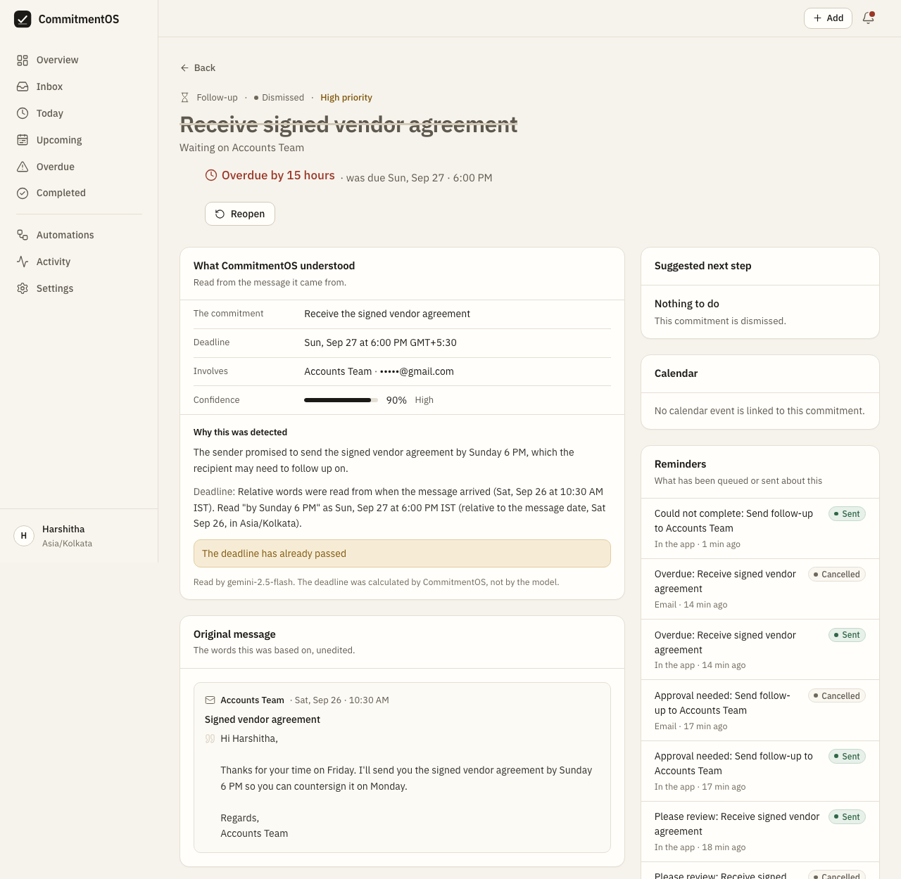
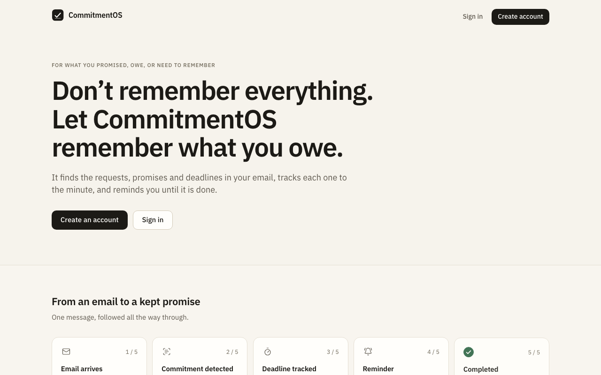

# CommitmentOS

### Turn hidden commitments into trackable obligations.

CommitmentOS identifies actionable requests, promises, and deadlines hidden in everyday communication and turns them into
structured commitments that can be tracked from detection to completion.

## Live Demo

[Open CommitmentOS](https://commitmentos.vercel.app) - frontend on Vercel, API and n8n on Render, PostgreSQL on Neon, all on
free tiers. Idle Render services sleep, so the first request can take about a minute, and the automation engine needs several
minutes after waking before an imported email is processed. Email delivery does not work from this free hosting
(see [Limitations](#limitations)).

## The Problem

People already have task managers, but many commitments never become tasks. They live inside emails, requests, replies and
deadlines that were mentioned once and never written down.

The hard part is not remembering a task. It is noticing that an obligation exists in the first place, and following it
through until it is done.

## The Solution

CommitmentOS receives real messages, extracts candidate commitments, keeps the exact words it relied on, resolves the
deadline with code, stores the commitment, reminds you as the deadline approaches, and records everything that happened.

```
Email (pasted, webhook or Gmail Trigger)
        |
        v
n8n: Commitment Detection workflow
        |
        v
Extraction (LLM) -> Validation and grounding -> Deterministic deadline resolution
        |
        v
PostgreSQL
        |
        v
Reminder engine (24h, 6h, overdue, escalated) -> Notification -> Completion
                                                       |
                                          Activity timeline and audit log
```

### The model reads. Code decides.

A language model is used for the one thing code cannot do: reading unstructured text and proposing structured fields (is
this a commitment, what is the action, what does the deadline phrase say, verbatim).

Everything that carries consequences is ordinary, tested application code that never trusts the model's output as-is:

- validating and grounding the extraction against the source text
- turning a deadline phrase into a timestamp
- create / review / ignore thresholds and deduplication
- state transitions, overdue detection and escalation
- reminder scheduling and notification de-duplication
- authorization, persistence and the audit trail

The model never sees the database, never returns a timestamp that is trusted on its own, and never triggers an external
action. A prompt injection inside an email can at worst produce a proposal that a person still has to accept.

## Features

- Import an email by pasting it, through an ingest webhook, or (once you connect it) a Gmail Trigger in n8n
- Structured commitment extraction with the supporting quote preserved as evidence
- Deterministic deadline resolution: relative dates, weekdays, ranges, business hours, the user's timezone and DST
- Commitment state machine: detected, needs review, open, action required, scheduled, overdue, escalated, completed, dismissed, with snooze and reopen
- Idempotent ingestion: the same message is recognised before the model is called; similar commitments are merged
- Reminder ladder (24h before, 6h before, overdue, escalated), each rung sent once and silenced once you act
- In-app notifications, plus email (SMTP) and Telegram delivery channels
- Human approval for anything with an external effect: follow-up emails and calendar events are proposals until you accept
- Follow-up emails go only to the address the original email came from
- Activity timeline per commitment, an append-only audit log, and an automations console listing every workflow run
- Email/password accounts with per-user data isolation
- Manual, recurring and snoozed commitments

## Architecture

| Layer | Responsibility |
|---|---|
| Frontend (`apps/web`) | Interface, sign-in, commitment views, inbox for review and approvals, settings. Talks only to `/api/*`, proxied so the browser sees one origin and the session cookie stays first-party. |
| Backend (`apps/api`) | Authorization, validation, business rules, the deadline engine, reminder processing, persistence, audit. Runs migrations on start. |
| n8n (`automation/n8n`) | Orchestration: triggers and schedules, retries, hand-offs, delivery through SMTP, Telegram and calendar nodes. Eight workflows generated from source. It decides *when* things run, never *what is true*. |
| LLM | Understanding unstructured text and returning structured candidates. Gemini or any OpenAI-compatible server; or none. |
| PostgreSQL | The only source of truth. n8n keeps its own database on the same server. |

```
apps/
  api/            FastAPI service, Alembic migrations (alembic/versions), tests
  web/            Next.js application, unit tests
automation/n8n/   workflow definitions, Code-node logic, generated workflows, import scripts, tests
e2e/              end-to-end tests against an isolated Docker stack
database/init/    creates the n8n database on first Postgres start
scripts/          environment setup and developer helpers
docs/             architecture, deployment, extraction evaluation
docker-compose.yml, render.yaml, .env.example
```

The n8n/API contracts, the failure model and the reasoning behind them are in [docs/architecture.md](docs/architecture.md).

## Tech Stack

| Layer | Technology |
|---|---|
| Frontend | Next.js 16 (App Router), React 19, TypeScript, Tailwind CSS 4, TanStack Query, Radix UI, Framer Motion |
| Backend | FastAPI, Python 3.12, SQLAlchemy 2, Pydantic 2, Alembic |
| Database | PostgreSQL (16 in Docker Compose, 18 on Neon in the hosted deployment) |
| Automation | n8n 2.40 (self-hosted, workflows generated from JavaScript definitions) |
| Extraction | Google Gemini (REST) or any OpenAI-compatible chat-completions server |
| Email | SMTP for sending; Mailpit as the local sink; Gmail Trigger in n8n for reading (not verified, see below) |
| Authentication | Email and password (Argon2id), signed JWT in an httpOnly cookie |
| Testing | pytest, Vitest, Node test runner, end-to-end suite on Docker Compose |
| Deployment | Vercel (frontend), Render (API, n8n), Neon (database); Docker Compose locally |

## A Real-World Flow

An email arrives saying: *"Please send the signed document by Friday at 5 PM."*

1. n8n receives the message (pasted in the app, or delivered to the ingest webhook).
2. The API checks whether this exact message was already processed, before any model call.
3. The model identifies an actionable request and returns the deadline phrase exactly as written, "by Friday at 5 PM",
   together with the supporting quote.
4. The API checks that the quote really appears in the message; anything it cannot verify is sent to review.
5. Code resolves "Friday at 5 PM" relative to the message's own date and the user's timezone, and records how it did so.
6. The commitment is stored, with the source message kept as evidence. A missing, ambiguous or already-past deadline puts it
   in review instead of silently creating it.
7. The reminder ladder is scheduled from the resolved deadline.
8. The user is notified; each reminder is sent once.
9. Completing the commitment stops its reminders; every step is on the timeline.

The source email drives all of this. The model never sets or changes the deadline.

## Screenshots



A commitment detected from a real imported email on the hosted deployment: what was understood, the deadline with the
explanation of how code resolved it, the deadline warning, and the unedited original message. The item had been dismissed
when this was captured, and the counterparty's address is masked.



## Getting Started

Requires Docker with Compose v2. Running the tests also needs Node.js 22+ and [uv](https://docs.astral.sh/uv/) (Python 3.12).

```
git clone https://github.com/AswarthaHarshitha/commitmentos.git
cd commitmentos
./scripts/init-env.sh          # creates .env from .env.example and fills the secrets with random values
```

Set `GEMINI_API_KEY` in `.env` (a [Google AI Studio](https://aistudio.google.com/apikey) key), or point `LLM_PROVIDER` at an
OpenAI-compatible server, or `none` (messages are then recorded as failed extractions). Then:

```
docker compose up -d --build   # postgres, mailpit, n8n (imported and activated), api, web
```

| | URL |
|---|---|
| Application | http://localhost:3000 |
| API documentation | http://localhost:8000/docs |
| n8n | http://localhost:5678 (the first visit asks you to create the owner account) |
| Mailpit (every outgoing email is caught here) | http://localhost:8025 |

Register an account, then use **Import an email** to paste a real message.

Frontend development: `cd apps/web && npm ci && npm run dev` (talks to the API on `localhost:8000`).
Regenerate the API types with `npm run gen:api`.

## Gmail

Gmail is read by n8n's own Gmail Trigger node; there is no separate Google OAuth flow in the application. The node ships
disabled and **has not been verified**, because it needs a Google credential only the account owner can create.

1. Create a Google Cloud project and enable the Gmail API.
2. Configure the OAuth consent screen (in *Testing* mode only the test users you list can authorize it).
3. Create an OAuth client ID of type *Web application*.
4. Add the redirect URI that n8n shows in its credential dialog (`https://<n8n host>/rest/oauth2-credential/callback`).
5. In n8n, create a *Gmail OAuth2 API* credential with the client ID and secret and sign in with Google.
6. Enable the trigger and set the mailbox owner in the workflow definition.

Steps 5 and 6 have caveats (workflows are re-imported from source on start), described in
[automation/n8n/README.md](automation/n8n/README.md#connecting-gmail). Until Gmail is connected, real email enters the same
pipeline through **Import an email** or the ingest webhook. No credential belongs in the repository or in `.env.example`.

## n8n

n8n is the orchestrator: triggers, schedules, retries and hand-offs. The API makes every decision that matters, so n8n is
never the source of truth.

- **Workflows** are generated from `automation/n8n/definitions/` by `node automation/n8n/build.js` into
  `automation/n8n/workflows/*.json` (committed, so a diff shows what changed). Their Code-node logic is plain functions
  with unit tests.
- **Import**: `docker compose up` runs `automation/n8n/import.sh` before n8n starts: credentials are built from environment
  variables, the workflows are imported and each is published. After changing a workflow, run `./scripts/n8n-reload.sh`.
- **Reaching the backend**: n8n calls the API with `X-Webhook-Secret`; the API calls n8n's webhooks with `X-CommitmentOS-Key`.
  Two independent secrets, one per direction.
- **Inspecting executions**: open n8n's *Executions* view. Each row in the app's Automation Activity page carries n8n's own
  execution id.

Details, including what each of the eight workflows does: [automation/n8n/README.md](automation/n8n/README.md).

## Email Notifications

Outgoing email is sent by n8n over SMTP. Until you configure an account, everything is caught by Mailpit on your machine and
the app says so (a banner, and `email_delivery` in `/api/system/status`) instead of reporting success. For a real account, set
these in `.env`:

```
SMTP_HOST=smtp.gmail.com
SMTP_PORT=465
SMTP_SECURE=true
SMTP_USER=you@gmail.com
SMTP_PASSWORD=<app password>
NOTIFY_FROM_EMAIL=you@gmail.com
```

then `docker compose up -d api && ./scripts/n8n-reload.sh`. SMTP credentials are environment variables and are never
committed. A Gmail **App Password** is a separate 16-character password created under Google Account > Security > 2-Step
Verification > App passwords; it is not your normal Gmail password. In a deployment, put these in the platform's environment
or secret configuration, not in files.

## Database

PostgreSQL, with the schema managed by Alembic (`apps/api/alembic/versions`, four migrations). The API container runs
`alembic upgrade head` on start. To run migrations by hand against the Compose database:

```
source scripts/dev-env.sh
cd apps/api && uv run alembic upgrade head
```

Integrity is enforced in the database as well as in code: enum `CHECK` constraints, an idempotency ledger (unique on user,
source type and external id), an anti-duplication constraint on notifications, and an append-only trigger on the audit log.
`./scripts/psql.sh` opens `psql` inside the Compose Postgres container.

## Testing

| Suite | Command | Result at last run |
|---|---|---|
| API (real PostgreSQL) | `source scripts/dev-env.sh && cd apps/api && uv run pytest -q` | 836 passed |
| n8n workflow code | `node --test automation/n8n/tests/*.test.js` | 68 passed |
| Frontend unit tests | `cd apps/web && npm test` | 81 passed |
| End to end (isolated Docker stack) | `apps/api/.venv/bin/python -m pytest e2e -q` | 33 passed |

Lint and type checks: `uv run ruff check .` in `apps/api`, and `npm run lint` and `npm run typecheck` in `apps/web`.

What the suites cover: authentication and authorization (other users' objects return 404, internal routes reject user
tokens), extraction validation and grounding, deadline arithmetic across timezones and DST, deduplication, the reminder
ladder, notification delivery and retry, atomic claiming of approvals, API behaviour when the database is down, and the
n8n Code-node logic. The end-to-end suite builds its own Compose project with its own database, ports and secrets, drives
real n8n executions and real SMTP into Mailpit, and uses a scripted stand-in for the model and a test-only virtual clock;
it refuses to run against a stack that holds real data ([e2e/README.md](e2e/README.md)). Extraction quality against real
models is measured separately in [docs/eval/README.md](docs/eval/README.md). Tests are run locally; this repository has no
CI workflow.

## Deployment

| Component | Where | Notes |
|---|---|---|
| Frontend | Vercel | Root directory `apps/web`; `API_URL` points at the API. Redeploys on push to `main`. |
| API | Render (Docker) | Applies migrations on start. |
| n8n | Render (Docker) | Imports and publishes the workflows on every start, behind a small proxy that holds the public port. |
| Database | Neon | Two databases: the application's and n8n's. |

`render.yaml` is a Blueprint for the two Render services. The full walkthrough, including the environment variables each
service needs and what to check afterwards, is in [docs/deployment.md](docs/deployment.md). Two points from there matter
in practice: claim the n8n owner account immediately after the first deploy (a fresh n8n lets the first visitor become the
owner), and set `ALLOW_REGISTRATION=false` once your own account exists.

## Security

- Passwords are hashed with Argon2id. Sessions are short-lived signed JWTs in an httpOnly, SameSite=Lax cookie, marked
  Secure in production.
- Every object lookup is scoped to the signed-in user; another user's object returns 404, not 403.
- Request bodies are validated with strict Pydantic models. CORS is an explicit allow-list.
- Email content is treated as untrusted: it is fenced in the prompt, the model's output is validated and grounded against the
  source text, and failure reports are scrubbed of tokens and message bodies.
- n8n and the API authenticate each other with two separate shared secrets, compared in constant time; user sessions cannot
  call the internal routes.
- Ingestion is idempotent, and claims on approvals and notifications are atomic (`FOR UPDATE SKIP LOCKED`), so a repeated
  webhook cannot send or execute twice.
- A follow-up can only be addressed to the sender of the original email, checked when it is proposed and again just before
  it is sent.
- Rate limiting on login, registration and the general API.
- Secrets live in environment variables and, encrypted, inside n8n. `.env` is git-ignored and no credential is committed.

## Limitations

- **Gmail ingestion is not verified.** It needs a Google Cloud OAuth client, testing-mode apps are limited to listed test
  users and their refresh tokens expire after 7 days, and enabling the trigger durably means changing the workflow source.
  Google Calendar and Telegram delivery are likewise unverified.
- **Email does not leave the hosted deployment.** Render's free tier blocks outbound SMTP on ports 25, 465 and 587, so
  n8n's sends time out there. The app records the failure and retries rather than reporting a send. Locally, mail goes to
  Mailpit or to any SMTP account you configure. Options are in [docs/deployment.md](docs/deployment.md#6-real-smtp).
- **Free-tier hosting sleeps.** After 15 idle minutes the Render services stop; n8n needs several minutes to import and
  start again, and its scheduled reminders do not run while it is asleep.
- **Extraction can be wrong.** Low-confidence, ungrounded or ambiguous results go to review instead of being created, but the
  evaluation is small (53 hand-labelled emails, mostly a small local model) and is not a claim about accuracy on real mail.
  Free-tier Gemini plans may use prompts to improve their models, so use a paid or local model for a real mailbox.
- **Follow-ups are sent from the system SMTP account** with you as `Reply-To`, not from your own mailbox, and without
  threading headers.
- **Notifications are in-app, email and Telegram.** There are no browser push notifications.
- **The API is designed to run as a single process**: the rate limiter and the test-only virtual clock are per-process.
- **Registration is open by default** (`ALLOW_REGISTRATION=true`) so the first account can be created.
